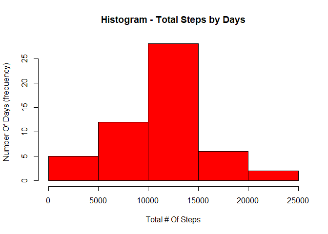
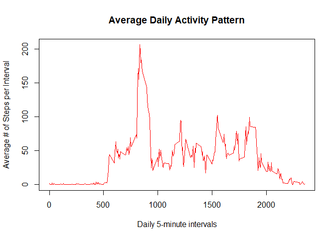
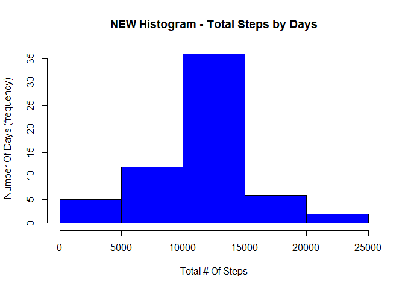
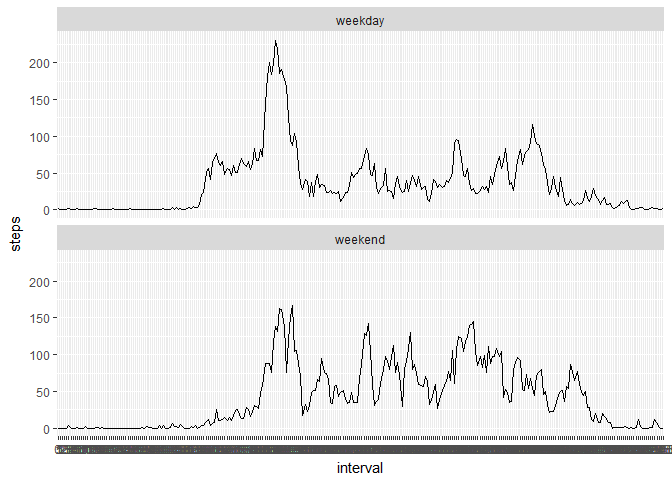

--- 
title: "Reproducible Research: Peer Assessment 1" 
output: 
  html_document: 
    keep_md: true 
---
## Mark Olander

There are 5 Parts (each with multiple steps):

## 1) Loading and preprocessing the data.
I will show all code and all output directly below it's corresponding code:

```r
library(ggplot2)
```

```
## Warning: package 'ggplot2' was built under R version 3.4.2
```

```r
library(knitr)
knitr::opts_chunk$set(echo = TRUE, results = "hold")
```

Firstly, make sure the "activity.csv"" file is unzipped and placed in your wd.

1.1) Then we load the data into R....

```r
RRdata <- read.csv('activity.csv', header = TRUE, sep = ",",
          colClasses=c("numeric", "Date", "numeric"))
```

Let's look at the structure of the data:

```r
str(RRdata)
```

```
## 'data.frame':	17568 obs. of  3 variables:
##  $ steps   : num  NA NA NA NA NA NA NA NA NA NA ...
##  $ date    : Date, format: "2012-10-01" "2012-10-01" ...
##  $ interval: num  0 5 10 15 20 25 30 35 40 45 ...
```

1.2) It will help if we convert "Interval" to a Factor:

```r
RRdata$interval <- as.factor(RRdata$interval)
```

Let's look at the structure of the data again:

```r
str(RRdata)
```

```
## 'data.frame':	17568 obs. of  3 variables:
##  $ steps   : num  NA NA NA NA NA NA NA NA NA NA ...
##  $ date    : Date, format: "2012-10-01" "2012-10-01" ...
##  $ interval: Factor w/ 288 levels "0","5","10","15",..: 1 2 3 4 5 6 7 8 9 10 ...
```


## 2) What is mean total number of steps taken per day?

2.1) Calculate the total steps per day:

```r
total_steps_per_day <- aggregate(steps ~ date, data = RRdata, sum, na.rm = TRUE)
total_steps_per_day
```

```
##          date steps
## 1  2012-10-02   126
## 2  2012-10-03 11352
## 3  2012-10-04 12116
## 4  2012-10-05 13294
## 5  2012-10-06 15420
## 6  2012-10-07 11015
## 7  2012-10-09 12811
## 8  2012-10-10  9900
## 9  2012-10-11 10304
## 10 2012-10-12 17382
## 11 2012-10-13 12426
## 12 2012-10-14 15098
## 13 2012-10-15 10139
## 14 2012-10-16 15084
## 15 2012-10-17 13452
## 16 2012-10-18 10056
## 17 2012-10-19 11829
## 18 2012-10-20 10395
## 19 2012-10-21  8821
## 20 2012-10-22 13460
## 21 2012-10-23  8918
## 22 2012-10-24  8355
## 23 2012-10-25  2492
## 24 2012-10-26  6778
## 25 2012-10-27 10119
## 26 2012-10-28 11458
## 27 2012-10-29  5018
## 28 2012-10-30  9819
## 29 2012-10-31 15414
## 30 2012-11-02 10600
## 31 2012-11-03 10571
## 32 2012-11-05 10439
## 33 2012-11-06  8334
## 34 2012-11-07 12883
## 35 2012-11-08  3219
## 36 2012-11-11 12608
## 37 2012-11-12 10765
## 38 2012-11-13  7336
## 39 2012-11-15    41
## 40 2012-11-16  5441
## 41 2012-11-17 14339
## 42 2012-11-18 15110
## 43 2012-11-19  8841
## 44 2012-11-20  4472
## 45 2012-11-21 12787
## 46 2012-11-22 20427
## 47 2012-11-23 21194
## 48 2012-11-24 14478
## 49 2012-11-25 11834
## 50 2012-11-26 11162
## 51 2012-11-27 13646
## 52 2012-11-28 10183
## 53 2012-11-29  7047
```

2.2) Create a histogram for the total # of steps per day:

```r
hist(total_steps_per_day$steps, main="Histogram - Total Steps by Days", xlab="Total # Of Steps", ylab="Number Of Days (frequency)", col="red")
```

<!-- -->

2.3) Calculate and report the mean and median of the total number of steps taken per day:

```r
mean_steps   <- mean(total_steps_per_day$steps)
mean_steps
```

```
## [1] 10766.19
```


```r
median_steps <- median(total_steps_per_day$steps)
median_steps
```

```
## [1] 10765
```


## 3) What is the average daily activity pattern?

Create vector to store avg steps per interval (to use in plot):

```r
IntervalSteps <- tapply(RRdata$steps, RRdata$interval, mean, na.rm = TRUE)
```

Let's look at the structure of the data:

```r
str(IntervalSteps)
```

```
##  num [1:288(1d)] 1.717 0.3396 0.1321 0.1509 0.0755 ...
##  - attr(*, "dimnames")=List of 1
##   ..$ : chr [1:288] "0" "5" "10" "15" ...
```

3.1) Time series plot on average daily activity pattern:

```r
plot(row.names(IntervalSteps), IntervalSteps, type = "l", col="red", xlab = "Daily 5-minute intervals", ylab = "Average # of Steps per Interval", main = "Average Daily Activity Pattern")
```

<!-- -->

3.2) Which 5-minute interval, on average across all the days in the dataset, contains the maximum number of steps?

```r
MaxStepsInterval <- which.max(IntervalSteps)
names(MaxStepsInterval)
```

```
## [1] "835"
```

Check the results.....

```r
str(MaxStepsInterval)
```

```
##  Named int 104
##  - attr(*, "names")= chr "835"
```

```r
IntervalSteps[104]
```

```
##      835 
## 206.1698
```


## 4) Imputing missing values.
4.1) Calculate the total number of missing values in the dataset?

```r
TotalNAs <- sum(is.na(RRdata$steps))
TotalNAs
```

```
## [1] 2304
```

4.2 & 4.3) Create new dataset and fill NA's with average steps per interval:

```r
RRdata2 <- RRdata
RRdata2$steps <- with(RRdata2, ave(steps, interval, FUN = function(x) replace(x, is.na(x), mean(x, na.rm = TRUE))))
str(RRdata2)
```

```
## 'data.frame':	17568 obs. of  3 variables:
##  $ steps   : num  1.717 0.3396 0.1321 0.1509 0.0755 ...
##  $ date    : Date, format: "2012-10-01" "2012-10-01" ...
##  $ interval: Factor w/ 288 levels "0","5","10","15",..: 1 2 3 4 5 6 7 8 9 10 ...
```

Check number of missing values in the new dataset?

```r
TotalNAs2 <- sum(is.na(RRdata2$steps))
TotalNAs2
```

```
## [1] 0
```

4.4) Create a histogram for the total # of steps per day (using new dataset):

```r
total_steps_per_day2 <- aggregate(steps ~ date, data = RRdata2, sum, na.rm = TRUE)
hist(total_steps_per_day2$steps, main="NEW Histogram - Total Steps by Days", xlab="Total # Of Steps", ylab="Number Of Days (frequency)", col="blue")
```

<!-- -->

```r
total_steps_per_day2
```

```
##          date    steps
## 1  2012-10-01 10766.19
## 2  2012-10-02   126.00
## 3  2012-10-03 11352.00
## 4  2012-10-04 12116.00
## 5  2012-10-05 13294.00
## 6  2012-10-06 15420.00
## 7  2012-10-07 11015.00
## 8  2012-10-08 10766.19
## 9  2012-10-09 12811.00
## 10 2012-10-10  9900.00
## 11 2012-10-11 10304.00
## 12 2012-10-12 17382.00
## 13 2012-10-13 12426.00
## 14 2012-10-14 15098.00
## 15 2012-10-15 10139.00
## 16 2012-10-16 15084.00
## 17 2012-10-17 13452.00
## 18 2012-10-18 10056.00
## 19 2012-10-19 11829.00
## 20 2012-10-20 10395.00
## 21 2012-10-21  8821.00
## 22 2012-10-22 13460.00
## 23 2012-10-23  8918.00
## 24 2012-10-24  8355.00
## 25 2012-10-25  2492.00
## 26 2012-10-26  6778.00
## 27 2012-10-27 10119.00
## 28 2012-10-28 11458.00
## 29 2012-10-29  5018.00
## 30 2012-10-30  9819.00
## 31 2012-10-31 15414.00
## 32 2012-11-01 10766.19
## 33 2012-11-02 10600.00
## 34 2012-11-03 10571.00
## 35 2012-11-04 10766.19
## 36 2012-11-05 10439.00
## 37 2012-11-06  8334.00
## 38 2012-11-07 12883.00
## 39 2012-11-08  3219.00
## 40 2012-11-09 10766.19
## 41 2012-11-10 10766.19
## 42 2012-11-11 12608.00
## 43 2012-11-12 10765.00
## 44 2012-11-13  7336.00
## 45 2012-11-14 10766.19
## 46 2012-11-15    41.00
## 47 2012-11-16  5441.00
## 48 2012-11-17 14339.00
## 49 2012-11-18 15110.00
## 50 2012-11-19  8841.00
## 51 2012-11-20  4472.00
## 52 2012-11-21 12787.00
## 53 2012-11-22 20427.00
## 54 2012-11-23 21194.00
## 55 2012-11-24 14478.00
## 56 2012-11-25 11834.00
## 57 2012-11-26 11162.00
## 58 2012-11-27 13646.00
## 59 2012-11-28 10183.00
## 60 2012-11-29  7047.00
## 61 2012-11-30 10766.19
```

Calculate and report the mean and median of the total number of steps taken per day (on new data frame:

```r
mean_steps2   <- mean(total_steps_per_day2$steps)
mean_steps2
```

```
## [1] 10766.19
```


```r
median_steps2 <- median(total_steps_per_day2$steps)
median_steps2
```

```
## [1] 10766.19
```

Do these values differ from the estimates from the first part of the assignment?
What is the impact of imputing missing data on the estimates of the total daily number of steps?

Yes, the median values changed higher a bit, from 10765 to 10766.19 (which is also the mean again). More inportantly, the frequency has increased for the 10k-15k "steps" bucket, which also contains the median counts.We gained 8 new days, from 53 to 61, of which previously were all NA's.But now they have total steps of 10766.19, so they went from missing into the 10k-15k "steps" bucket. Which explains why this bucket was the only "increasing" bucket!


## 5) Are there differences in activity patterns between weekdays and weekends?

5.1) Create a new factor variable in the dataset with two levels - "weekday" and "weekend" indicating whether a given date is a weekday or weekend day.

```r
RRdata2$day <- weekdays(as.Date(RRdata2$date))
RRdata2$dayofweek <- ifelse (RRdata2$day %in% c("Saturday","Sunday"), 'weekend', 'weekday')
RRdata2$dayofweek <- as.factor(RRdata2$dayofweek)
str(RRdata2)
```

```
## 'data.frame':	17568 obs. of  5 variables:
##  $ steps    : num  1.717 0.3396 0.1321 0.1509 0.0755 ...
##  $ date     : Date, format: "2012-10-01" "2012-10-01" ...
##  $ interval : Factor w/ 288 levels "0","5","10","15",..: 1 2 3 4 5 6 7 8 9 10 ...
##  $ day      : chr  "Monday" "Monday" "Monday" "Monday" ...
##  $ dayofweek: Factor w/ 2 levels "weekday","weekend": 1 1 1 1 1 1 1 1 1 1 ...
```

5.2) Make a panel plot containing a time series plot, averaged across all weekday days or weekend days:

```r
stepsByDayLevel2 <- aggregate(steps ~ interval + dayofweek, data=RRdata2, mean)
```


```r
ggplot(stepsByDayLevel2, aes(x=interval, y=steps, group = 1)) + 
        geom_line() + facet_wrap(~ dayofweek, ncol=1)
```

<!-- -->

Thus, Yes, there are differences in activity patterns between weekdays and weekends. It's clear that weekday activity hits the highest peak. 
But, we also see that weekends have less volatility and more sustained 
mid tier peaks than weekdays do. 

